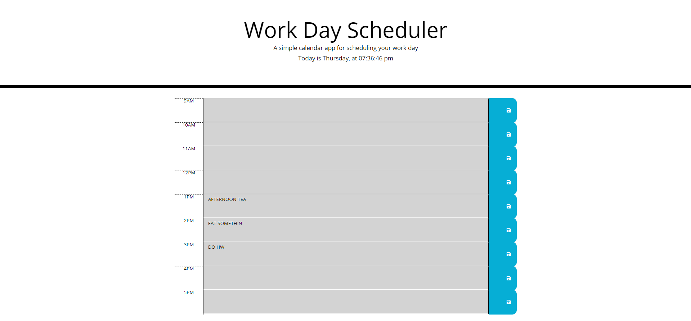
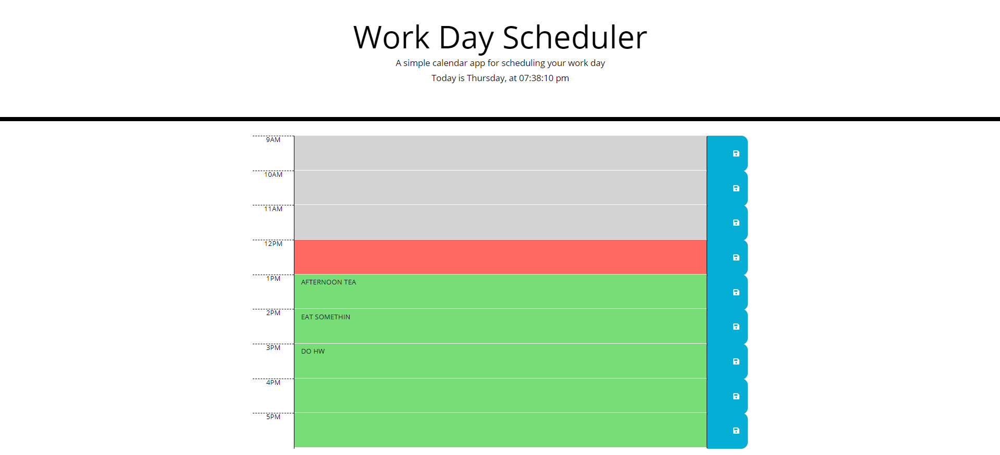

# 05 Third-Party APIs: Work Day Scheduler

## Description
A Simple Calendar Application that allows a user to save events for each hour of the day by clicking the right save icon. This app will run in the browser and feature dynamically updated HTML and CSS powered by jQuery. Date and time works through the use of [Moment.js](https://momentjs.com/) library.

- This app uses time interval, local storage, iterations and DOM traversions. Moment.js learned from Week 3 (22 MAR - 24 MAR) 
- To efficiently manage time while learning, build a Work Day Scheduler using HTML and CSS powered by jQuery!
- A good practice of using iterations, conditional statements inside of looping statement, comparing time converted from Moment.js, using setInterval() for a live action of time, DOM traversing throught the use of jQuery selectors and setItem/getItem to/from local storage.

### Screenshots
The following image shows the web application's appearance and functionality:

- The index.html

- Live time is 12pm.

#### URLs
https://irvinek01.github.io/Homework5/
https://github.com/irvinek01/Homework5

##### SPECIAL THANKS
- https://stackoverflow.com/questions/17179957/how-to-select-a-textarea-by-its-type-and-parent-div-with-jquery/17180004

- Mr. John
- Maam Janani
- My Whole class
- Would like to commend the following persons for helping directly(guiding me what to do next)/indirectly(asking questions to the instructors that I'm not aware of):
  ~ Elvis Lee
  ~ William Lucht
  ~ Tyler Abegg
  ~ Steven LeValley
